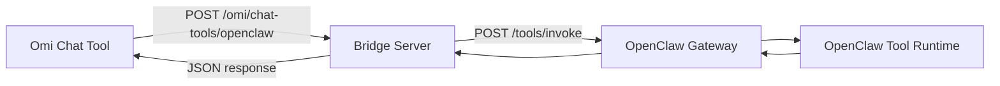

# Omi to OpenClaw Bridge

This project implements the recommended path: run your own `OpenClaw` gateway integration and let Omi Chat Tools invoke it through a simple webhook.

## Why this path

- Full control over tool routing and payload shape.
- Works with Omi Integration Apps and Chat Tools.
- No platform lock-in from managed wrappers.

## Architecture



## Task Traceability

1. Define bridge contract: [bridge.py](/Users/owlxshri/Downloads/openomi/src/omi_openclaw_bridge/bridge.py)
2. Expose webhook endpoint/auth: [server.py](/Users/owlxshri/Downloads/openomi/src/omi_openclaw_bridge/server.py)
3. Validate mapping and auth logic: [test_bridge.py](/Users/owlxshri/Downloads/openomi/tests/test_bridge.py), [test_server.py](/Users/owlxshri/Downloads/openomi/tests/test_server.py)
4. Run verification suite: `python3 -m unittest discover -s tests -v`

## Environment Variables

- `OPENCLAW_BASE_URL` (required): OpenClaw gateway base URL, for example `https://gateway.yourdomain.com`
- `OPENCLAW_DEFAULT_TOOL` (required unless passed per request): default tool name, for example `tools.search`
- `OPENCLAW_API_KEY` (optional): bearer token sent to OpenClaw gateway
- `OMI_WEBHOOK_TOKEN` (optional but recommended): token required from Omi
- `OPENCLAW_TIMEOUT_SECONDS` (optional, default `20`)
- `HOST` (optional, default `0.0.0.0`)
- `PORT` (optional, default `8080`)

## Run

```bash
export OPENCLAW_BASE_URL="https://gateway.yourdomain.com"
export OPENCLAW_DEFAULT_TOOL="tools.search"
export OPENCLAW_API_KEY="your-openclaw-key"
export OMI_WEBHOOK_TOKEN="your-omi-webhook-token"
PYTHONPATH=src python3 -m omi_openclaw_bridge
```

## Omi Chat Tool Setup

Use this webhook URL in your Omi Chat Tool:

- `POST https://<your-bridge-domain>/omi/chat-tools/openclaw`

Use one of these auth headers from Omi:

- `Authorization: Bearer <OMI_WEBHOOK_TOKEN>`
- `X-Omi-Token: <OMI_WEBHOOK_TOKEN>`

## Omi Request Payload Expected By Bridge

```json
{
  "openclaw_tool": "tools.search",
  "arguments": {
    "query": "find daily standup notes"
  },
  "session_id": "abc-123"
}
```

Notes:
- `openclaw_tool` is optional when `OPENCLAW_DEFAULT_TOOL` is configured.
- If `arguments` is missing, bridge falls back to `input`, then `params`, then passthrough payload.

## OpenClaw Request Sent By Bridge

```json
{
  "tool": "tools.search",
  "name": "tools.search",
  "input": {
    "query": "find daily standup notes"
  },
  "arguments": {
    "query": "find daily standup notes"
  },
  "session_id": "abc-123"
}
```

## Response Returned To Omi

```json
{
  "status": "ok",
  "text": "tool result text",
  "openclaw": {
    "result": "tool result text"
  }
}
```

## Tests

```bash
python3 -m unittest discover -s tests -v
```
